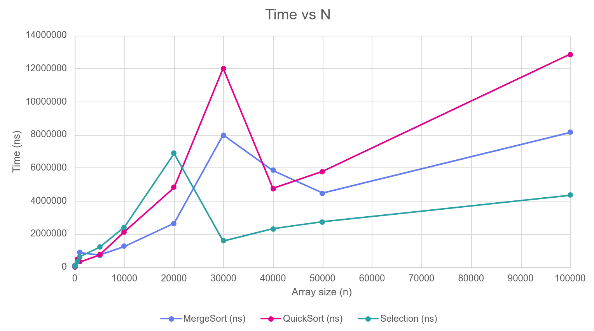
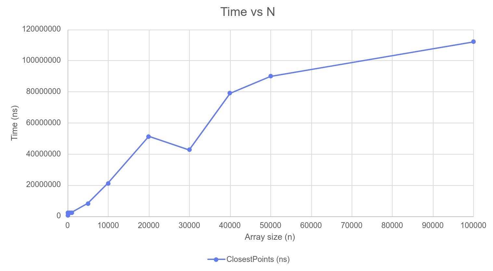
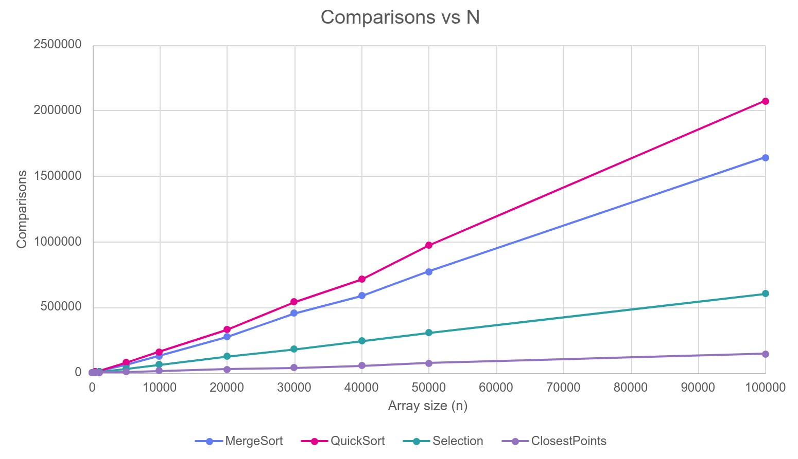
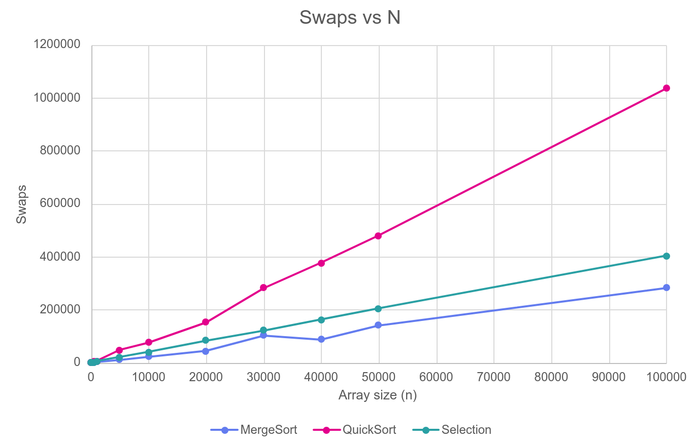
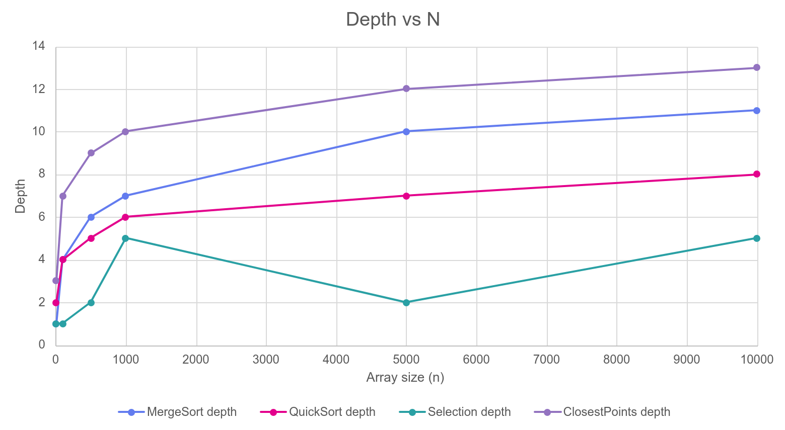

# Design and Analysis of Algorithms Assignment 1


## Learning goals
- Implement classic divide-and-conquer algorithms with safe recursion patterns
- Analyze running-time recurrences using Master Theorem (3 cases) and Akra–Bazzi intuition; validate
with measurements.
- Collect metrics (time, recursion depth, comparisons/allocations) and communicate results via a short
report and clean Git history.

## Featured algorithms
- MergeSort (linear merge, buffer reuse, small-n cutoff to insertion sort)
- QuickSort (randomized pivot, bounded recursion depth)
- Deterministic Select (Median of Medians)
- Closest Pair of Points in 2D

<details>
<summary style="font-size: 24px; font-family: monospace;">Command-line interface (CLI)</summary>

The command line interface is available to generate inputs, run algorithms, and emit CSV results.

- Build the JAR:

```bash
mvn clean package
```

- General usage:

```bash
java -jar target/algorithms-1.0.jar \
  --algo <mergesort|quicksort|select|closest> \
  --size <n> \
  [--k <k>] \
  --csv <output.csv> \
  [--seed <seed>]
```

- Options:
  - `--algo` (required): which algorithm to run
    - `mergesort` – sort an integer array with MergeSort
    - `quicksort` – sort an integer array with QuickSort (randomized pivot)
    - `select` – deterministic select (Median-of-Medians) to fetch the k-th element
    - `closest` – closest pair of points in 2D (divide and conquer)
  - `--size` (required): input size (array length or number of points)
  - `--k` (required for `select`): 0-based index of the order statistic (0..size-1)
  - `--csv` (required): path to the CSV file to append results to
  - `--seed` (optional): RNG seed for reproducible inputs (default: current time)

- Examples:

```bash
# MergeSort over 100k integers
java -jar target/algorithms-1.0.jar --algo mergesort --size 100000 --csv mergesort_results.csv

# QuickSort over 100k integers
java -jar target/algorithms-1.0.jar --algo quicksort --size 100000 --csv quicksort_results.csv

# Deterministic Select: median (k=50000, 0-based) of a 100k array
java -jar target/algorithms-1.0.jar --algo select --size 100000 --k 50000 --csv deterministicselect_results.csv

# Closest Pair on 10k random points
java -jar target/algorithms-1.0.jar --algo closest --size 10000 --csv closestpair_results.csv
```

- CSV output columns:
  - MergeSort / QuickSort / DeterministicSelect:
    - `algorithm,array size,time(ns),comparisons,swaps,maxdepth`
  - Closest Pair of Points:
    - `ClosestPairOfPoints,array size,time(ns),comparisons,maxdepth,distance`

Tip: provide `--seed` to make runs reproducible.

</details>

## Architecture notes
- Metrics: time (ns), comparisons, swaps, recursion depth (maxDepth). Timer starts/stops at public API.
- Depth: enterRecursion/exitRecursion around recursive calls; QS uses smaller-first recursion to keep stack O(log n).
- Memory: MergeSort reuses one buffer; QuickSort/Select partition in-place; ClosestPair: one x-sort + linear strip scan.
- Small-n: MergeSort falls back to insertion sort on tiny subarrays.

## Recurrence analysis
### MergeSort
- T(n) = 2T(n/2) + O(n)
- Two recursive calls, linear merge.
- Master Theorem (case 2) ⇒ O(n log n)
- Insertion-sort cutoff improves constants.
### Randomized QuickSort (smaller-first recursion)
- T(n) = T(U) + T(n − U − 1) + O(n) ⇒ O(n log n). (U is the random pivot position)
- With bad pivots worst-case is O(n²);
- Stack O(log n) because of recursion only into the smaller side.
### Deterministic Select (Median-of-Medians, groups of 5)
- T(n) = T(n/5) + T(7n/10) + Θ(n) ⇒ Θ(n) (MoM/Akra–Bazzi).
- Take medians of groups of five (cost O(n)), recurse once on the medians array of size n/5, and finally recurse only into at most 7n/10 of the original elements after partitioning.
- Recurse only into the needed, preferably smaller, side.
### Closest Pair of Points (2D)
- After x-sort: T(n) = 2T(n/2) + O(n).
- Master Theorem (case 2) ⇒ O(n log n)
- Strip comparisons limited (~7–8 neighbors), so O(n log n).

## Plots
### Time vs Array size



### Comparisons vs Array size


### Swaps vs Array size


### Depth vs Array size


## Summary
- MergeSort: maintains ~ n log n time complexity.
- QuickSort: comparisons ~ n log n; depth stays near O(log n) because of smaller-first recursion;
- Deterministic Select: near-linear growth in time/operations; matches O(n).
- Closest Pair: scales ~ n log n; strip neighbor bound holds; depth ~ log n.

The plots of time vs. n and depth vs. n show the expected asymptotic trends, although constant-factor effects such as cache behavior and GC might insignificantly affect the measurements.